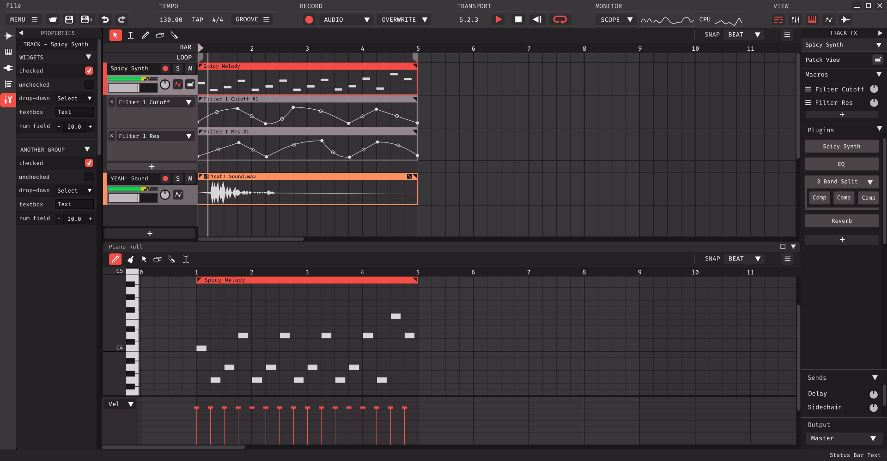

#  Meadowlark

An open-source and fully-featured Digital Audio Workstation, made by musicians, for musicians.

  

**Current design mockup, not a functioning product yet. Final design is subject to change.*

## Get Involved

Come joing us on our [`Discord Server`]! *(music artists, designers, developers, and general users welcome!)*

We also are active in the [`Rust Audio Discord Server`] where we develop some of the generic backend modules for the [`RustyDAW`] project. Please keep discussions there about the [`RustyDAW`] project and not about Meadowlark specifically. *(developers only please)*

Developers should also take a look at the current [`Design Document`].

[`Design Document`]: ./DesignDoc.md
[`Discord Server`]: https://discord.gg/2W3Xvc8wy4
[`Rust Audio Discord Server`]: https://discord.gg/Qs2Zwtf9Gf
[`RustyDAW`]: https://github.com/RustyDAW
