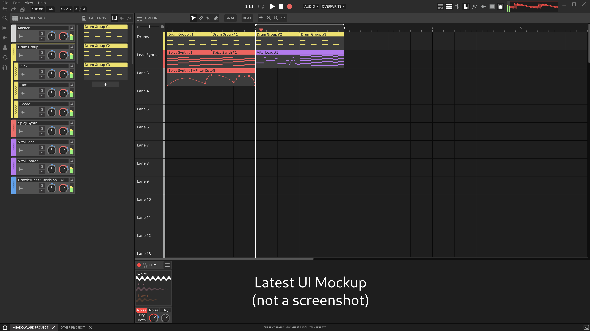

<div align="center"><h1>Meadowlark</h1></div>

[](./LICENSE)
[](https://github.com/MeadowlarkDAW/Meadowlark/actions/workflows/build.yml)
[](https://discord.gg/2W3Xvc8wy4)

Meadowlark is a (currently incomplete) project that aims to be a FREE and open-source DAW (Digital Audio Workstation) for Linux, Mac and Windows. Its goals are to be a powerful recording, composing, editing, sound designing, mixing, and mastering tool for artists around the world, while also being intuitive and customizable.

### ***This project is still in the early stages of development and is not ready for any kind of production use or any alpha/beta testing. Please see below on how you can get involved to help us develop this project!***

<hr/>

<center>
  
</center>

**Current design mockup, not a screenshot. Final design is subject to change.*

<hr/>

## Get Involved

Before contributing or participating in discussions with the community, you should familiarize yourself with our [Code of Conduct].

* The kanban-style [project-board] for this project.

* Come join us on our [Discord Server]! *(music artists, designers, developers, and general users welcome!)*

* We are also somewhat active in the [Rust Audio Discord Server] *(developers only please)*. Please keep discussions there about Rust audio development in general and not about Meadowlark specifically.

* Developers may take a look at the current [Design Document].

# Build Instructions

## 1. Install prerequisites for your system

Make sure [Rust] is installed on your system and is up-to-date.

## Linux

Arch/Manjaro and derivatives:
```
sudo pacman -S base-devel gtk4 alsa-lib
```

Debian/Ubuntu and derivatives:
```
sudo apt install build-essential libgtk-4-dev libasound2-dev
```

Fedora and derivatives:
```
sudo dnf install gcc gtk4-devel alsa-lib-devel
```

## MacOS

Make sure [homebrew](https://brew.sh/) is installed on your system.

Install dependencies:
```
brew install pkgconfig gtk4 librsvg
```

## Windows

Make sure [MSYS2](https://www.msys2.org/) is installed on your system and is up-to-date.

### Windows - Install dependencies
Open the app titled `MSYS2 MINGW64`, and then run this command inside it to install the dependencies:
```
pacman -S mingw-w64-x86_64-gtk4 mingw-w64-x86_64-pkgconf mingw-w64-x86_64-gcc
```

### Windows - Update Path environment variable

1. Open the Windows Settings app -> Search and open `Advanced system settings` -> Click on `Environment variables`
2. Select `Path` -> Click on `Edit` -> Add the following three entries:
```
C:\msys64\mingw64\include
C:\msys64\mingw64\bin
C:\msys64\mingw64\lib
```
3. Restart your system for the changes to take effect.

### Windows - Setup the GNU toolchain for Rust
1. Make sure the GNU toolchain for Rust is installed and up-to-date:
```
rustup toolchain install stable-gnu
rustup update
```

2. Run this command in the root of your downloaded Meadowlark folder to tell cargo to use the GNU toolchain for this folder (This will NOT affect any other Rust projects you have on your system):
```
rustup override add stable-gnu
```

3. Make sure any old build data from the non-GNU toolchain is cleaned up:
```
cargo update
cargo clean
```

## 2. Building

To run in debug mode (shortest compile time):
```
cargo run
```

To run in release mode (longer compile time, better performance):
```
cargo run --release
```

To run in optimized release mode (longest compile time, best performance):
```
cargo run --profile release-lto
```

[Design Document]: ./DESIGN_DOC.md
[Discord Server]: https://discord.gg/2W3Xvc8wy4
[Rust Audio Discord Server]: https://discord.gg/Qs2Zwtf9Gf
[Rust]: https://www.rust-lang.org/
[Code of Conduct]: ./CODE_OF_CONDUCT.md
[project-board]: https://github.com/orgs/MeadowlarkDAW/projects/3/views/1
