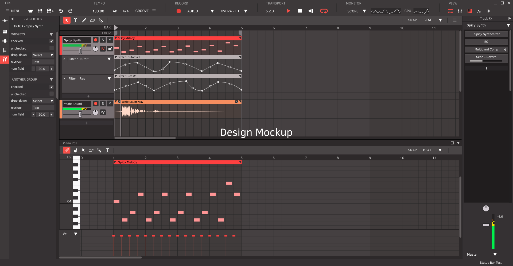

<h1>Meadowlark</h1>

Meadowlark is a FREE and open-source DAW (Digital Audio Workstation) for Linux, Mac and Windows. It aims to be an accessible and powerful recording, composing, editing, sound designing, mixing, and mastering tool for artists around the world, while also being intuitive and customizable.

It is proudly written in the [Rust] programming language, allowing for higher stability without compromising on performance.

### ***This project is still in the early stages of development. Please see below on how you can get involved.***

  

**Current design mockup, not a functioning product yet. Final design is subject to change.*

## Get Involved

Before contributing or participating in discussions with the community, you should familiarize yourself with our [Code of Conduct].

* Come join us on our [Discord Server]! *(music artists, designers, developers, and general users welcome!)*

* We are also active in the [Rust Audio Discord Server] where we develop some of the generic backend modules for the [RustyDAW] project. Please keep discussions there about the [RustyDAW] project and not about Meadowlark specifically. *(developers only please)*

* Developers should also take a look at the current [Design Document].

* Meadowlark is currently being used as a testbed for the upcoming [Tuix] GUI library, and we are working close with the developer for the benefit of both projects. If a GUI library written in Rust interests you, please check them out and give them your support!

[Design Document]: ./DESIGN_DOC.md
[Discord Server]: https://discord.gg/2W3Xvc8wy4
[Rust Audio Discord Server]: https://discord.gg/Qs2Zwtf9Gf
[RustyDAW]: https://github.com/RustyDAW
[Rust]: https://www.rust-lang.org/
[Code of Conduct]: ./CODE_OF_CONDUCT.md
[Tuix]: https://github.com/geom3trik/tuix
