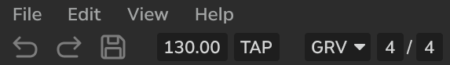
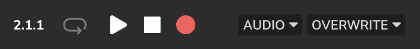

# Meadowlark UX Design Document

(*TODO: overview*)

# Objective

(*TODO*)

# Goals
(*TODO*)

# Non-Goals
(*TODO*)

# UX Design

Note that this is just a mockup and the final design is subject to change. Here is the most up-to-date mockup for Meadowlark:

## Top Bar

### Section 1

* We start with the traditional "File/Edit/View/Help" dropdown menus. I feel these are pretty self-explanatory.

(From left to right)
* Undo/Redo buttons
* Save button
* The tempo in bpm at the current playhead. The user can drag on this widget like a slider to change this value, or they may double-click this box to enter a new tempo with the keyboard.
* When the user clicks this multiple times, it will set the bpm value to the left according to the rate at which they clicked it.
* Groove Menu - When the user clicks this, a dialog box with groove settings will appear (settings like swing and volume accents). *(This dialog box has not been designed yet.)*
* The time signature at the current playhead. The user can drag on this widget like a slider to change this value, or they may double-click this box to enter a new value with the keyboard.

### Section 2

(From left to right)
* Transport Display - The user can click on this to toggle between two different modes:
    * Musical time - This will display the time at the current playhead in (measures/beats/16th beats).
    * Real time - This will display the time at the current playhead in (hours/minuts/seconds/milliseconds).
* Loop Toggle Button - The user can click on this to toggle looping in the transport.
* Play button - The user clicks this to play/pause the transport.
* Stop button - The user clicks this to pause the transport and return to the beginning of the most recently seeked position.
* Record button - *(TODO: decide on recording workflow)*
* Record settings - *(TODO: decide on recording workflow)*

*TODO: Rest of the design doc.*